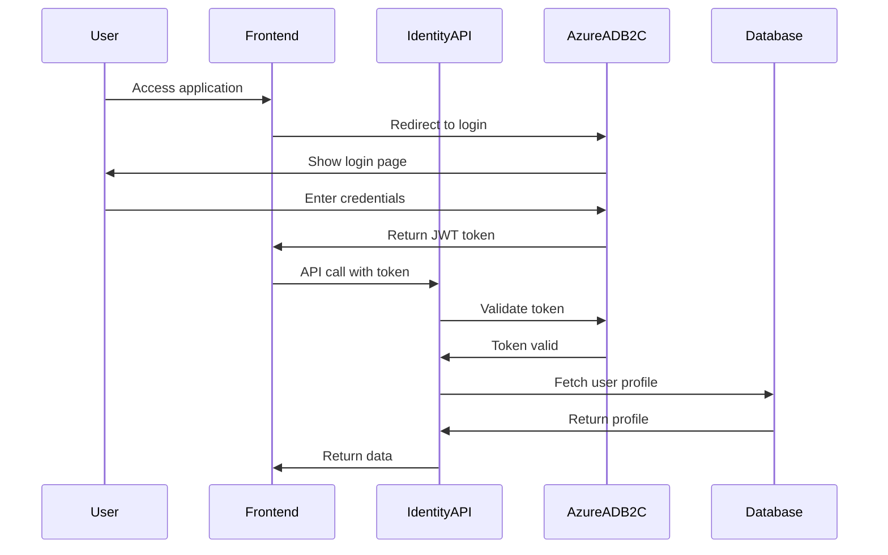

# StudentLink Platform - AI-Powered Recruitment System

> **Phase 1 Complete**: Identity & Core Infrastructure ?

## ?? Project Overview

StudentLink is an AI-powered recruitment and CV intelligence platform designed to connect South African graduates with employers efficiently. The system leverages Azure cloud services, .NET 9, and AI technologies to automate CV parsing, profile creation, and intelligent candidate matching.

### Key Features (MVP)
- ? **CV Upload & Parsing** - Extract structured data from PDF/DOCX resumes
- ? **Student Profiles** - Automatically generated from parsed CVs
- ? **AI Matching** - Semantic search and job-candidate matching
- ? **Recruiter Portal** - Search, filter, and shortlist candidates
- ? **Role-Based Access** - Student, Recruiter, and Admin roles
- ? **Azure Integration** - Fully cloud-native on Azure

---

## ??? Architecture

### Tech Stack
- **Backend**: .NET 9 (C# 13)
- **Database**: Azure SQL Database
- **Authentication**: Azure AD B2C (JWT Bearer tokens)
- **Storage**: Azure Blob Storage
- **AI/ML**: Azure OpenAI, Form Recognizer
- **Search**: Azure Cognitive Search
- **Messaging**: Azure Service Bus
- **Monitoring**: Application Insights
- **Security**: Azure Key Vault

### Microservices Architecture
```
???????????????????     ???????????????????     ???????????????????
?  Identity API   ??????? Profile API     ???????  Matching API   ?
?  (Phase 1 ?)   ?     ?  (Phase 3)      ?     ?  (Phase 4)      ?
???????????????????     ???????????????????     ???????????????????
        ?                       ?                       ?
        ?????????????????????????????????????????????????
                            ?
                ?????????????????????????
                ?                       ?
        ?????????????????      ?????????????????
        ? CV Management ?      ?  Recruiter API ?
        ? (Phase 2)     ?      ?  (Phase 5)     ?
        ?????????????????      ?????????????????
```

---

## ?? Project Structure

```
StudentLinkApi_Sln/
??? StudentLinkApi/                  # Identity API (Phase 1 ?)
?   ??? Controllers/
?   ?   ??? AuthController.cs       # Authentication & user management
?   ??? Data/
?   ?   ??? ApplicationDbContext.cs # EF Core context
?   ??? Models/
?   ?   ??? User.cs                 # User entity
?   ?   ??? Profile.cs              # Student profile entity
?   ??? DTOs/
?   ?   ??? UserDtos.cs             # Data transfer objects
?   ??? Program.cs                  # App configuration
?   ??? appsettings.json            # Configuration
??? infrastructure/                  # Infrastructure as Code
?   ??? main.bicep                  # Azure resources definition
?   ??? main.parameters.json        # Deployment parameters
?   ??? deploy.ps1                  # Deployment script
?   ??? quick-start.ps1             # One-click setup
?   ??? setup-b2c.ps1              # B2C configuration guide
?   ??? TROUBLESHOOTING.md         # Deployment troubleshooting
??? PHASE1-DEPLOYMENT.md            # Phase 1 deployment guide
??? README.md                       # This file
```

---

## ?? Quick Start

### Prerequisites
- [.NET 9 SDK](https://dotnet.microsoft.com/download/dotnet/9.0)
- [Azure CLI](https://docs.microsoft.com/en-us/cli/azure/install-azure-cli)
- [Azure Subscription](https://azure.microsoft.com/free/)
- [Visual Studio 2022](https://visualstudio.microsoft.com/) or [VS Code](https://code.visualstudio.com/)

### 1. Clone Repository
```powershell
git clone https://github.com/YOUR_ORG/StudentLinkApi.git
cd StudentLinkApi_Sln
```

### 2. Deploy Azure Infrastructure
```powershell
# Login to Azure
az login

# Run one-click deployment
cd infrastructure
.\quick-start.ps1
```

> **Having issues?** Check [infrastructure/TROUBLESHOOTING.md](infrastructure/TROUBLESHOOTING.md)

### 3. Configure Azure AD B2C
```powershell
# Follow interactive setup guide
.\setup-b2c.ps1
```

### 4. Update Configuration
Edit `StudentLinkApi/appsettings.json` with your Azure resource details (see `PHASE1-DEPLOYMENT.md` for detailed instructions).

### 5. Run Database Migrations
```powershell
cd StudentLinkApi
dotnet ef database update
```

### 6. Run the Application
```powershell
dotnet run
```

Navigate to: `https://localhost:7XXX/auth/ping`

For complete deployment instructions, see **[PHASE1-DEPLOYMENT.md](PHASE1-DEPLOYMENT.md)**.

---

## ?? Authentication Flow



---

## ?? API Endpoints (Phase 1)

### Public Endpoints
| Method | Endpoint       | Description       | Auth Required |
|--------|----------------|-------------------|---------------|
| GET    | `/auth/ping`   | Health check      | ?            |

### Authenticated Endpoints
| Method | Endpoint            | Description              | Role Required |
|--------|---------------------|--------------------------|---------------|
| GET    | `/auth/me`          | Get current user info    | Any           |
| POST   | `/auth/register`    | Register user in DB      | Any           |
| GET    | `/auth/profile/{id}`| Get user profile by ID   | Any           |
| PUT    | `/auth/profile`     | Update own profile       | Any           |
| GET    | `/auth/me/student`  | Test student role access | Student       |
| GET    | `/auth/me/recruiter`| Test recruiter access    | Recruiter     |
| GET    | `/auth/me/admin`    | Test admin access        | Admin         |

### Example Requests

**Get Current User**
```bash
GET /auth/me
Authorization: Bearer YOUR_B2C_JWT_TOKEN

Response:
{
  "authenticated": true,
  "oid": "abc123...",
  "name": "John Doe",
  "email": "john@example.com",
  "roles": ["Student"],
  "dbUser": {
    "id": "guid...",
    "email": "john@example.com",
    "role": "Student",
    "firstName": "John",
    "lastName": "Doe"
  }
}
```

**Register User**
```bash
POST /auth/register
Authorization: Bearer YOUR_B2C_JWT_TOKEN
Content-Type: application/json

{
  "email": "john@example.com",
  "role": "Student",
  "firstName": "John",
  "lastName": "Doe",
  "phoneNumber": "+27821234567"
}
```

---

## ??? Database Schema (Phase 1)

### Users Table
```sql
CREATE TABLE Users (
    Id UNIQUEIDENTIFIER PRIMARY KEY DEFAULT NEWID(),
    B2CObjectId NVARCHAR(100) NOT NULL UNIQUE,
    Email NVARCHAR(256) NOT NULL,
    Role NVARCHAR(50) NOT NULL DEFAULT 'Student',
    FirstName NVARCHAR(100),
    LastName NVARCHAR(100),
    PhoneNumber NVARCHAR(20),
    CreatedAt DATETIME2 NOT NULL DEFAULT GETUTCDATE(),
    UpdatedAt DATETIME2,
    IsActive BIT NOT NULL DEFAULT 1
);
```

### Profiles Table
```sql
CREATE TABLE Profiles (
    Id UNIQUEIDENTIFIER PRIMARY KEY DEFAULT NEWID(),
    UserId UNIQUEIDENTIFIER NOT NULL UNIQUE,
    Summary NVARCHAR(500),
    Skills NVARCHAR(MAX),       -- JSON array
    Education NVARCHAR(MAX),    -- JSON array
    Experience NVARCHAR(MAX),   -- JSON array
    CvUrl NVARCHAR(500),
    LinkedInUrl NVARCHAR(100),
    GitHubUrl NVARCHAR(100),
    PortfolioUrl NVARCHAR(100),
    CreatedAt DATETIME2 NOT NULL DEFAULT GETUTCDATE(),
    UpdatedAt DATETIME2,
    CONSTRAINT FK_Profiles_Users FOREIGN KEY (UserId) REFERENCES Users(Id) ON DELETE CASCADE
);
```

---

## ?? Configuration

### appsettings.json Structure
```json
{
  "ConnectionStrings": {
    "DefaultConnection": "YOUR_SQL_CONNECTION_STRING"
  },
  "KeyVault": {
    "Uri": "https://YOUR_KEYVAULT.vault.azure.net/"
  },
  "ApplicationInsights": {
    "ConnectionString": "YOUR_APPINSIGHTS_CONNECTION_STRING"
  },
  "AzureAdB2C": {
    "Instance": "https://YOUR_TENANT.b2clogin.com",
    "Domain": "YOUR_TENANT.onmicrosoft.com",
    "TenantId": "YOUR_TENANT_ID",
    "SignUpSignInPolicyId": "B2C_1_signupsignin",
    "ClientId": "YOUR_API_CLIENT_ID"
  }
}
```

---

## ?? Development Roadmap

### ? Phase 1: Identity & Core Infrastructure (2-3 weeks) - COMPLETE
- [x] Azure resource provisioning (Bicep IaC)
- [x] JWT authentication with Azure AD B2C
- [x] User management API
- [x] Database schema & EF Core
- [x] Application Insights integration
- [x] Key Vault configuration

### ?? Phase 2: CV Management & Parsing (3 weeks) - NEXT
- [ ] CV upload to Blob Storage
- [ ] Service Bus queue integration
- [ ] Azure Form Recognizer integration
- [ ] CV parsing Azure Function
- [ ] Profile auto-generation

### ?? Phase 3: Profile API & Search (2 weeks)
- [ ] Profile CRUD operations
- [ ] Azure Cognitive Search indexing
- [ ] Advanced search & filtering

### ?? Phase 4: AI Matching (2 weeks)
- [ ] Azure OpenAI embeddings
- [ ] Semantic job-candidate matching
- [ ] Job recommendation engine

### ?? Phase 5: Recruiter API (2 weeks)
- [ ] Candidate search portal
- [ ] Shortlisting functionality
- [ ] CV download (formatted)
- [ ] Recruiter notes

### ?? Phase 6: Production Readiness (2 weeks)
- [ ] API Gateway (Azure APIM)
- [ ] Load testing
- [ ] Security audit
- [ ] CI/CD pipelines

**Total Timeline**: ~15 weeks to MVP

---

## ?? Cost Estimate

### Monthly Azure Costs (Development)
| Service                  | Tier            | Cost/Month |
|--------------------------|-----------------|------------|
| Azure SQL Database       | Basic (2GB)     | ~$5        |
| App Service              | Free F1         | $0         |
| Blob Storage             | LRS (Hot)       | <$1        |
| Service Bus              | Basic           | $0.05      |
| Key Vault                | Standard        | $0.03      |
| Application Insights     | Free (5GB)      | $0         |
| **Total**                |                 | **~$6-10** |

### Production Costs (estimated)
- SQL Database (Standard S1): ~$30/month
- App Service (Standard S1): ~$70/month
- Azure OpenAI: Usage-based (~$10-50/month)
- Cognitive Search (Basic): ~$75/month
- **Total Production**: ~$200-300/month

---

## ?? Testing

### Run Unit Tests
```powershell
dotnet test
```

### Test with Postman
Import the collection from: `/docs/postman/StudentLink.postman_collection.json`

### Test Authentication
```powershell
# Get token from B2C (use OAuth 2.0 flow in Postman)
# Then test endpoints:
curl -X GET https://localhost:7XXX/auth/me \
  -H "Authorization: Bearer YOUR_TOKEN"
```

---

## ?? Security

- ? HTTPS enforced
- ? JWT token validation
- ? Role-based authorization
- ? SQL injection prevention (EF Core parameterized queries)
- ? Secrets stored in Azure Key Vault
- ? Managed Identity for Key Vault access
- ? SQL firewall rules

---

## ?? Troubleshooting

Having deployment issues? Check our comprehensive troubleshooting guide:
- **[infrastructure/TROUBLESHOOTING.md](infrastructure/TROUBLESHOOTING.md)** - Common issues and solutions

Quick fixes:
- Path errors: Make sure you're in the `infrastructure` directory
- Auth errors: Run `az login`
- SQL password: Must be 8+ chars with uppercase, lowercase, number, special char
- Key Vault access: Wait 15-30 seconds for RBAC propagation

---

## ?? Contributing

1. Fork the repository
2. Create a feature branch (`git checkout -b feature/amazing-feature`)
3. Commit your changes (`git commit -m 'Add amazing feature'`)
4. Push to the branch (`git push origin feature/amazing-feature`)
5. Open a Pull Request

---

## ?? License

This project is licensed under the MIT License - see [LICENSE](LICENSE) file.

---

## ?? Team & Support

- **Project Owner**: [Your Name]
- **Email**: [your.email@example.com]
- **Documentation**: 
  - [PHASE1-DEPLOYMENT.md](PHASE1-DEPLOYMENT.md) - Deployment guide
  - [QUICK-REFERENCE.md](QUICK-REFERENCE.md) - Developer quick reference
  - [infrastructure/TROUBLESHOOTING.md](infrastructure/TROUBLESHOOTING.md) - Troubleshooting

---

## ?? Additional Resources

- [Azure AD B2C Docs](https://docs.microsoft.com/en-us/azure/active-directory-b2c/)
- [.NET 9 Documentation](https://docs.microsoft.com/en-us/dotnet/core/whats-new/dotnet-9)
- [Entity Framework Core 9](https://docs.microsoft.com/en-us/ef/core/)
- [Azure Bicep](https://docs.microsoft.com/en-us/azure/azure-resource-manager/bicep/)

---

**Built with ?? for South African graduates**
